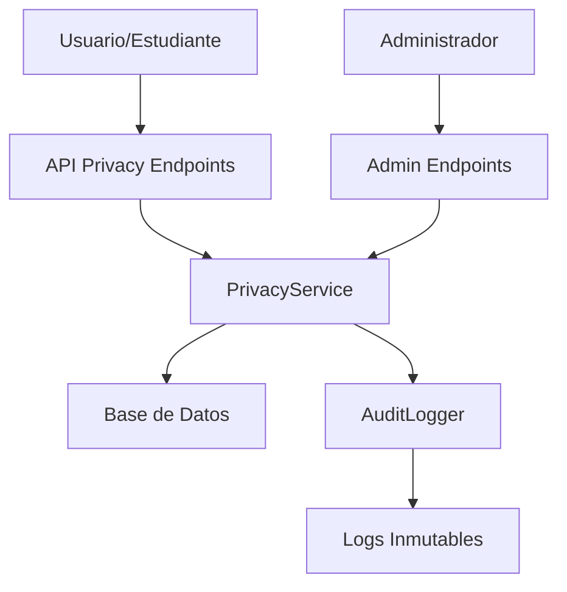

# Sistema de Privacidad de Datos - PRF2

## 🎯 Objetivo del Requerimiento PRF2

**PRF2 (Must): Debe existir un flujo para que el titular (estudiante) solicite acceso, rectificación o eliminación de datos personales.**

Este sistema implementa los derechos fundamentales de privacidad según GDPR/LOPD, permitiendo a los usuarios (estudiantes) ejercer control sobre sus datos personales.

## 🏛️ Base Legal

### GDPR (Reglamento General de Protección de Datos)
- **Art. 15**: Derecho de acceso del interesado
- **Art. 16**: Derecho de rectificación  
- **Art. 17**: Derecho de supresión («derecho al olvido»)
- **Art. 12**: Información transparente y modalidades de ejercicio

### LOPD (Ley Orgánica de Protección de Datos)
- Derechos ARCO (Acceso, Rectificación, Cancelación, Oposición)
- Plazos de respuesta: máximo 30 días

## 🔧 Implementación Técnica

### Arquitectura del Sistema



### Componentes Implementados

1. **Modelo de Datos** (`privacy_request.py`)
   - Tabla `privacy_requests` con estados y tipos
   - Enums para tipos y estados de solicitudes
   - Métodos de validación y expiración

2. **Servicio de Privacidad** (`privacy_service.py`)
   - Lógica de negocio para procesar solicitudes
   - Recopilación segura de datos personales
   - Operaciones de rectificación y eliminación

3. **API Endpoints** (`privacy.py`)
   - Endpoints para usuarios (crear solicitudes)
   - Endpoints para administradores (procesar)
   - Validación de permisos y datos

4. **Auditoría** (integrado en `audit_logger.py`)
   - Logs inmutables de todas las operaciones
   - Trazabilidad completa del proceso

## 📋 Flujos de Trabajo

### 1. Solicitud de Acceso (Art. 15 GDPR)

**Endpoint**: `POST /api/v1/privacy/request/access`

```json
{
  "description": "Solicito acceso a todos mis datos personales"
}
```

**Proceso**:
1. Usuario autenticado crea solicitud
2. Sistema registra en BD con estado `PENDING`
3. Admin recibe notificación
4. Admin procesa y genera reporte completo
5. Usuario recibe sus datos personales

### 2. Solicitud de Rectificación (Art. 16 GDPR)

**Endpoint**: `POST /api/v1/privacy/request/rectification`

```json
{
  "description": "Mi email actual es incorrecto",
  "rectification_data": {
    "email": "nuevo_email@correcto.com"
  }
}
```

**Proceso**:
1. Usuario especifica qué datos corregir
2. Admin revisa y valida la solicitud
3. Si aprueba: se aplican cambios automáticamente
4. Si rechaza: se documenta la razón
5. Usuario es notificado del resultado

### 3. Solicitud de Eliminación (Art. 17 GDPR)

**Endpoint**: `POST /api/v1/privacy/request/erasure`

```json
{
  "description": "Quiero eliminar todos mis datos",
  "confirmation": true
}
```

⚠️ **ATENCIÓN**: Esta operación es **IRREVERSIBLE**

**Proceso**:
1. Usuario confirma que entiende las consecuencias
2. Admin revisa la solicitud
3. Si aprueba: eliminación completa y automática de:
   - Datos personales del usuario
   - Todos sus proyectos
   - Archivos subidos
   - Historial de análisis
   - Reportes generados
4. Logs de auditoría se mantienen (requerimiento legal)

## 🚀 API Endpoints

### Para Usuarios (Estudiantes)

| Método | Endpoint | Descripción |
|--------|----------|-------------|
| GET | `/privacy/rights` | Información sobre derechos |
| POST | `/privacy/request/access` | Solicitar acceso a datos |
| POST | `/privacy/request/rectification` | Solicitar rectificación |
| POST | `/privacy/request/erasure` | Solicitar eliminación |
| GET | `/privacy/requests` | Ver mis solicitudes |
| GET | `/privacy/request/{id}` | Ver solicitud específica |

### Para Administradores

| Método | Endpoint | Descripción |
|--------|----------|-------------|
| GET | `/admin/privacy/requests/pending` | Solicitudes pendientes |
| POST | `/admin/privacy/request/{id}/process/access` | Procesar acceso |
| POST | `/admin/privacy/request/{id}/process/rectification` | Procesar rectificación |
| POST | `/admin/privacy/request/{id}/process/erasure` | Procesar eliminación |

## 🔒 Seguridad y Auditoría

### Control de Acceso
- **Usuarios**: Solo pueden ver/crear sus propias solicitudes
- **Administradores**: Pueden procesar todas las solicitudes
- **Autenticación**: JWT requerido para todos los endpoints

### Auditoría Completa
Todos los eventos se registran de forma inmutable:

```json
{
  "action": "PRIVACY_REQUEST",
  "user_id": 123,
  "request_id": 456,
  "request_type": "access",
  "timestamp": "2025-11-01T21:30:00Z",
  "hash": "sha256:..."
}
```

### Logs de Eventos
- Creación de solicitudes
- Procesamiento por administradores
- Acceso a datos personales
- Modificación de datos
- Eliminación de datos

## ⏱️ Tiempos de Respuesta

Según **GDPR Art. 12**:
- **Plazo estándar**: 30 días calendario
- **Extensión posible**: +60 días en casos complejos
- **Notificación**: El usuario debe ser informado de cualquier retraso

### Monitoreo Automático
El sistema incluye método `is_expired()` para:
- Detectar solicitudes vencidas
- Generar alertas automáticas
- Cumplimiento de plazos legales

## 📊 Estados de Solicitudes

| Estado | Descripción | Acción Siguiente |
|--------|-------------|------------------|
| `PENDING` | Recién creada | Espera revisión admin |
| `IN_PROGRESS` | En proceso | Admin trabajando |
| `APPROVED` | Aprobada | Ejecutar acción |
| `REJECTED` | Rechazada | Notificar razón |
| `COMPLETED` | Completada | Proceso finalizado |

## 🚨 Consideraciones Importantes

### Eliminación de Datos
- **Irreversible**: No hay backup ni recuperación
- **Cascada**: Elimina TODOS los datos relacionados
- **Logs**: Se mantienen por requerimientos legales
- **Confirmación**: Usuario debe confirmar explícitamente

### Rectificación Permitida
Campos que pueden ser modificados:
- ✅ Email
- ❌ ID de usuario (inmutable)
- ❌ Contraseña (proceso separado)
- ❌ Fechas de creación (auditoría)

### Datos Incluidos en Acceso
- Información personal del usuario
- Todos los proyectos creados
- Archivos subidos al sistema
- Vulnerabilidades detectadas
- Métricas de análisis
- Historial de actividad

## 🧪 Testing

```bash
# Ejecutar tests de privacidad
cd app
python -m pytest tests/test_privacy.py -v

# Verificar endpoints disponibles
curl -X GET http://localhost:8000/api/v1/privacy/rights
```

## 📝 Cumplimiento Legal

Este sistema asegura el cumplimiento de:

✅ **GDPR Art. 15** - Derecho de acceso  
✅ **GDPR Art. 16** - Derecho de rectificación  
✅ **GDPR Art. 17** - Derecho al olvido  
✅ **GDPR Art. 12** - Plazos de respuesta (30 días)  
✅ **Auditoría completa** - Logs inmutables  
✅ **Seguridad** - Control de acceso diferenciado  
✅ **Transparencia** - Información clara sobre derechos  

## 🔄 Mantenimiento

### Tareas Regulares
- Monitorear solicitudes vencidas
- Revisar logs de auditoría
- Actualizar políticas de retención
- Entrenar administradores en nuevos procesos

### Métricas Recomendadas
- Tiempo promedio de respuesta
- Tipos de solicitudes más comunes
- Tasa de aprobación/rechazo
- Cumplimiento de plazos legales